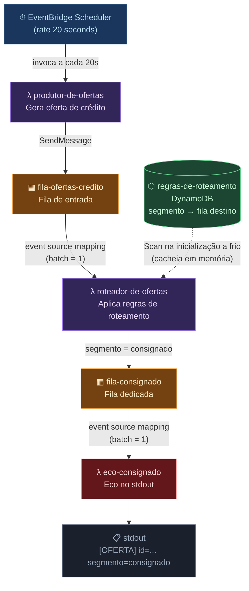

# Cenário 16 — Pipeline de Roteamento de Ofertas de Crédito

Demonstra um pipeline de eventos onde um agendador dispara periodicamente a criação de ofertas de crédito, um Lambda aplica regras de roteamento armazenadas no DynamoDB e encaminha as ofertas para filas dedicadas por segmento.

**Serviços AWS envolvidos:** EventBridge Scheduler · SQS · Lambda · DynamoDB

---

## Diagrama do fluxo



### Como o fluxo funciona

1. **EventBridge Scheduler** dispara a cada 20 segundos e invoca o `produtor-de-ofertas`
2. **`produtor-de-ofertas`** gera uma oferta de crédito (id, segmento, taxa, valor) e publica em `fila-ofertas-credito`
3. **`roteador-de-ofertas`** é acionado automaticamente pela fila. Na primeira execução (inicialização a frio), faz um `Scan` na tabela `regras-de-roteamento` do DynamoDB e cacheia as regras em memória
4. Para cada oferta, o roteador consulta o dicionário de regras e encaminha para a fila do segmento correspondente. Ofertas com segmento desconhecido são descartadas com um aviso no stdout
5. **`eco-consignado`** é acionado pela `fila-consignado` e imprime a oferta no stdout

---

## Estrutura do código

```
scenarios/16-Pipeline.Scheduler.Router/
├── Fixture.cs                  Provisionamento de todos os recursos AWS
├── RoteadorDeOfertasTests.cs   4 testes que cobrem o pipeline
├── Domain/
│   ├── OfertaDeCredito.cs      Tipo: id, segmento, taxa, valor
│   ├── RegraDeRoteamento.cs    Tipo: segmento → fila destino
│   └── ConfiguracaoDoAgendador.cs  Tipo retornado por ObterConfiguracaoDoAgendadorAsync
└── Support/
    ├── PipelineDeOfertas.cs    Helpers com vocabulário de negócio (submeter, verificar)
    └── SemeadorDeRegras.cs     Semear e ler regras de roteamento no DynamoDB

src/lambdas/
├── produtor_de_ofertas/handler.py   Gera oferta e publica em fila SQS
├── roteador_de_ofertas/handler.py   Aplica regras DynamoDB e roteia
└── eco_consignado/handler.py        Imprime oferta no stdout
```

---

## Rodando localmente com LocalStack

Este é o modo padrão. Não é necessário conta AWS — tudo roda em Docker.

### Pré-requisitos

- [.NET 10 SDK](https://dotnet.microsoft.com/download)
- [Docker Desktop](https://www.docker.com/products/docker-desktop/) em execução

### Executar

```bash
# A partir da raiz do projeto
dotnet test scenarios/16-Pipeline.Scheduler.Router/
```

O que acontece nos bastidores:

1. O xUnit inicia o `LocalStackFixture`
2. O Aspire sobe automaticamente um container `localstack/localstack:3.8` na porta `4566`
3. O Fixture cria todos os recursos AWS necessários (tabela, filas, funções Lambda, scheduler)
4. Os testes rodam contra o LocalStack
5. Ao final, o container é destruído automaticamente

### Ver a saída detalhada dos testes

```bash
dotnet test scenarios/16-Pipeline.Scheduler.Router/ \
  --logger "console;verbosity=detailed" 2>&1 \
  | grep -E "(\[xUnit| >>>|^     [^ ])"
```

### Resultado esperado

```
Total tests: 4
     Passed: 2       ← RegrasDeRoteamento + AgendadorDeOfertas
    Skipped: 2       ← Testes Lambda (não rodam no macOS ARM64 com LocalStack Community)
```

> **Por que 2 testes são pulados no macOS ARM64?**
> O LocalStack 3.8 Community tem uma limitação na execução de Lambdas no chip Apple Silicon.
> Os testes de pipeline completo (que invocam Lambdas) são automaticamente ignorados nessa plataforma.
> Em Linux ou CI, todos os 4 testes passam.

---

## Rodando na AWS real

Este modo se conecta diretamente à sua conta AWS em vez de usar o LocalStack. Os recursos são criados e destruídos automaticamente durante a execução dos testes.

### Pré-requisitos

1. **Conta AWS** com permissões para:
   - `dynamodb:CreateTable`, `dynamodb:PutItem`, `dynamodb:Scan`, `dynamodb:DescribeTable`
   - `sqs:CreateQueue`, `sqs:SendMessage`, `sqs:ReceiveMessage`, `sqs:GetQueueAttributes`
   - `lambda:CreateFunction`, `lambda:InvokeFunction`, `lambda:CreateEventSourceMapping`, `lambda:GetFunction`, `lambda:GetEventSourceMapping`
   - `scheduler:CreateSchedule`, `scheduler:GetSchedule`
   - `iam:PassRole` (para o Scheduler invocar o Lambda)

2. **IAM Role para o Scheduler** — o EventBridge Scheduler precisa de uma role com permissão `lambda:InvokeFunction`. Crie uma role chamada `agendador-ofertas-role` na sua conta com a seguinte trust policy:

   ```json
   {
     "Version": "2012-10-17",
     "Statement": [{
       "Effect": "Allow",
       "Principal": { "Service": "scheduler.amazonaws.com" },
       "Action": "sts:AssumeRole"
     }]
   }
   ```

   E attach a política `AWSLambdaRole` (ou uma política customizada com `lambda:InvokeFunction`).

3. **Credenciais AWS** configuradas. Escolha uma das opções:

   **Opção A — Variáveis de ambiente** (mais simples):
   ```bash
   export AWS_ACCESS_KEY_ID=sua-access-key
   export AWS_SECRET_ACCESS_KEY=sua-secret-key
   export AWS_DEFAULT_REGION=us-east-1
   ```

   **Opção B — AWS CLI configurado** (se já tem o CLI instalado):
   ```bash
   aws configure
   # preenche Access Key ID, Secret Access Key e região
   ```

### Executar

```bash
AWS_TARGET=aws dotnet test scenarios/16-Pipeline.Scheduler.Router/ \
  --logger "console;verbosity=detailed"
```

Ou com todas as variáveis em uma linha:

```bash
AWS_TARGET=aws \
AWS_ACCESS_KEY_ID=sua-access-key \
AWS_SECRET_ACCESS_KEY=sua-secret-key \
AWS_DEFAULT_REGION=us-east-1 \
dotnet test scenarios/16-Pipeline.Scheduler.Router/
```

### O que muda no modo AWS real

| Aspecto | LocalStack | AWS real |
|---|---|---|
| Onde os recursos são criados | Container Docker local | Conta AWS na região configurada |
| Credenciais | `test` / `test` (hardcoded) | Suas credenciais IAM |
| Endpoint | `http://localhost:4566` | Endpoints regionais da AWS |
| Container Docker necessário | Sim | Não |
| Custo | Gratuito | Cobranças normais da AWS¹ |

> ¹ Os recursos criados pelos testes (tabela DynamoDB, filas SQS, funções Lambda, schedule EventBridge) são destruídos automaticamente ao final da execução. O custo de uma execução de testes é irrisório (frações de centavo).

### Resultado esperado no modo AWS real

```
Total tests: 4
     Passed: 4       ← Todos os testes passam (sem skip de ARM64)
```

---

## Testes

| Teste | Plataforma | O que verifica |
|---|---|---|
| `OfertaConsignado_DeveSerRoteada_ParaFilaConsignado` | Linux / AWS | Oferta com `segmento=consignado` chega na `fila-consignado` após percorrer o pipeline completo |
| `OfertaSegmentoDesconhecido_NaoDeveChegar_NaFilaConsignado` | Linux / AWS | Oferta com segmento sem regra não contamina a fila consignado |
| `RegrasDeRoteamento_DevemEstarPresentes_NoDynamoDB` | Todas | A semeadura de regras no DynamoDB foi bem-sucedida |
| `AgendadorDeOfertas_DeveEstarConfigurado_ComTargetCorreto` | Todas | O Scheduler aponta para `produtor-de-ofertas` com `rate(20 seconds)` |

---

## Conceitos demonstrados

- **EventBridge Scheduler** — agendamento de tarefas periódicas sem servidor de cron
- **Event Source Mapping** — como uma fila SQS aciona uma Lambda automaticamente
- **Cache em memória no Lambda** — variáveis no escopo do módulo Python sobrevivem entre invocações do mesmo container (inicialização a frio apenas uma vez)
- **Roteamento baseado em dados** — regras de negócio armazenadas em DynamoDB em vez de hardcodadas no código
- **Dual-mode** — mesmo código de testes roda contra LocalStack local ou AWS real via `AWS_TARGET`
